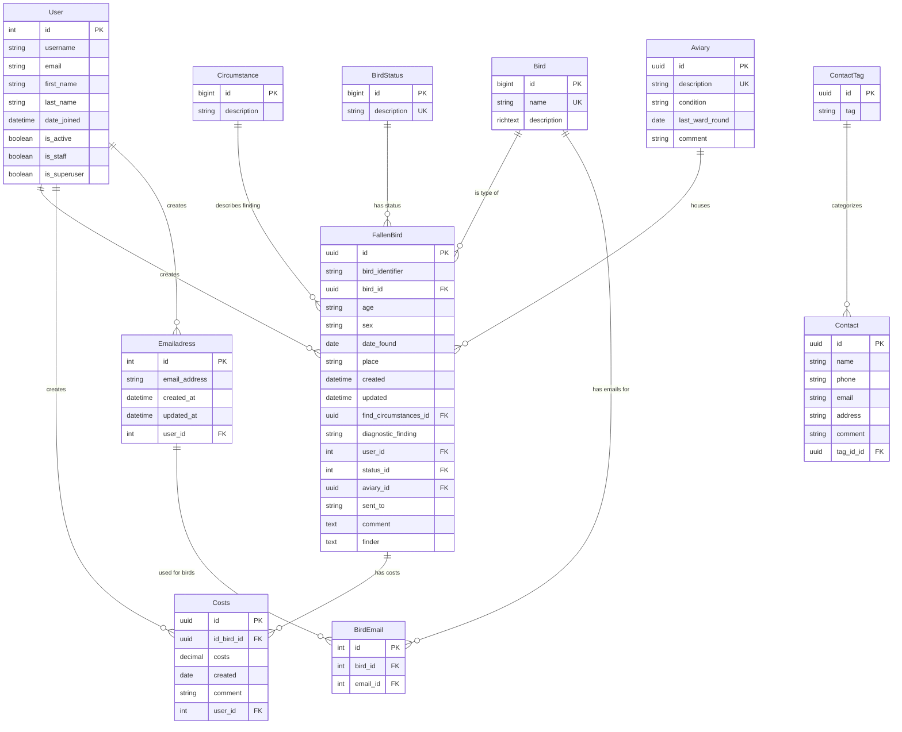

# ER-Diagramm - Django FBF Datenbank

## Übersicht der Datenbankstruktur

## Tabellenbeschreibungen

### Kern-Entitäten

#### `FallenBird` (Patienten)
- **Zweck**: Zentrale Entität für gefundene/verletzte Vögel
- **Primärschlüssel**: UUID
- **Beziehungen**: 
  - Gehört zu einem `Bird` (Vogelart)
  - Hat einen `BirdStatus` (Status)
  - Wird von einem `User` erstellt
  - Kann in einer `Aviary` (Voliere) untergebracht sein
  - Hat `Circumstance` (Fundumstände)
  - Kann `Costs` (Kosten) haben

#### `Bird` (Vogelarten)
- **Zweck**: Katalog der verschiedenen Vogelarten
- **Primärschlüssel**: BigInt
- **Eindeutig**: Name
- **Beziehungen**: Hat viele `FallenBird` Instanzen

#### `Aviary` (Volieren)
- **Zweck**: Unterbringungsplätze für die Vögel
- **Primärschlüssel**: UUID
- **Status**: Offen, Geschlossen, Gesperrt
- **Beziehungen**: Kann mehrere `FallenBird` beherbergen

### Referenz-Tabellen

#### `BirdStatus` (Patientenstatus)
- **Zweck**: Status-Katalog (z.B. "In Behandlung", "Freigelassen", "Verstorben")
- **Primärschlüssel**: BigInt

#### `Circumstance` (Fundumstände)
- **Zweck**: Katalog der Fundumstände (z.B. "Verletzt gefunden", "Aus Nest gefallen")
- **Primärschlüssel**: BigInt

### Kosten-Management

#### `Costs` (Kosten)
- **Zweck**: Kostenerfassung pro Patient
- **Primärschlüssel**: UUID
- **Beziehungen**: Gehört zu einem `FallenBird` und wird von einem `User` erstellt

### Kontakt-Management

#### `Contact` (Kontakte)
- **Zweck**: Kontaktdaten (Finder, Tierärzte, etc.)
- **Primärschlüssel**: UUID
- **Beziehungen**: Kann mit `ContactTag` kategorisiert werden

#### `ContactTag` (Kontakt-Tags)
- **Zweck**: Kategorisierung von Kontakten
- **Primärschlüssel**: UUID

### E-Mail-System

#### `Emailadress` (E-Mail-Adressen)
- **Zweck**: Verwaltung von E-Mail-Adressen
- **Primärschlüssel**: BigInt
- **Beziehungen**: Gehört zu einem `User`

#### `BirdEmail` (Vogel-E-Mail-Verknüpfung)
- **Zweck**: Many-to-Many Beziehung zwischen Vögeln und E-Mail-Adressen
- **Primärschlüssel**: BigInt

## Datenbank-Design-Prinzipien

### Primärschlüssel-Strategien
- **UUID**: Für Geschäftsobjekte (`FallenBird`, `Aviary`, `Contact`, `ContactTag`, `Costs`)
- **BigInt**: Für Referenzdaten (`Bird`, `BirdStatus`, `Circumstance`) und E-Mail-System

### Beziehungstypen
- **1:N**: Die meisten Beziehungen (User zu FallenBird, Bird zu FallenBird, etc.)
- **M:N**: `Bird` ↔ `Emailadress` über `BirdEmail`
- **Optional**: `FallenBird.aviary` (kann NULL sein)

### Besondere Eigenschaften
- **Soft References**: `Costs.id_bird` mit `SET_NULL` für Datenschutz
- **Audit Trail**: `created`/`updated` Felder in wichtigen Tabellen
- **Rich Text**: `Bird.description` für formatierte Beschreibungen
- **JSON/Array Fields**: Potentiell für Kosten-Historie (siehe `costs_default()` Funktion)

## Geschäftslogik-Unterstützung

Das Schema unterstützt folgende Geschäftsprozesse:

1. **Patientenaufnahme**: FallenBird → Bird, Circumstance, User
2. **Unterbringung**: FallenBird → Aviary
3. **Statusverfolgung**: FallenBird → BirdStatus
4. **Kostenverfolgung**: FallenBird → Costs
5. **Kontaktverwaltung**: Contact → ContactTag
6. **E-Mail-Benachrichtigungen**: Bird → BirdEmail → Emailadress
