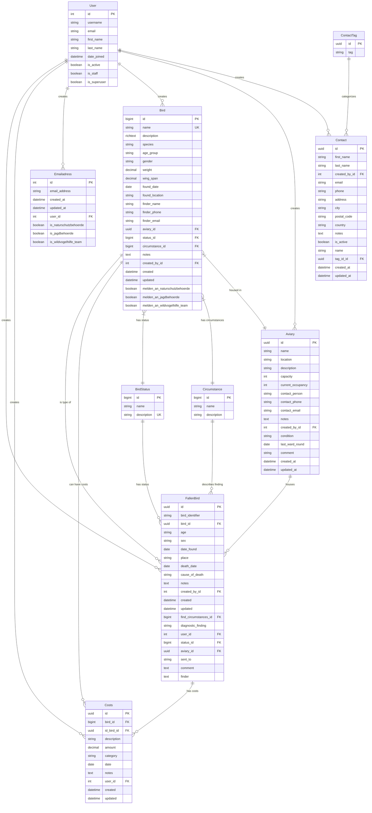

# ER-Diagramm - Django FBF Datenbank

## Übersicht der Datenbankstruktur

## Tabellenbeschreibungen

### Kern-Entitäten

#### `FallenBird` (Patienten)
- **Zweck**: Zentrale Entität für gefundene/verletzte Vögel (individuelle Patienten)
- **Primärschlüssel**: UUID
- **Neue Features**: 
  - Todesdatum und Todesursache für verstorbene Tiere
  - Erweiterte Notizen-Funktionalität
  - Verbesserte Audit-Trails
- **Beziehungen**: 
  - Gehört zu einem `Bird` (Vogelart)
  - Hat einen `BirdStatus` (Status)
  - Wird von einem `User` erstellt und bearbeitet
  - Kann in einer `Aviary` (Voliere) untergebracht sein
  - Hat `Circumstance` (Fundumstände)
  - Kann `Costs` (Kosten) haben

#### `Bird` (Vogelarten)
- **Zweck**: Katalog der verschiedenen Vogelarten mit umfassenden Metadaten
- **Primärschlüssel**: BigInt
- **Eindeutig**: Name
- **Neue Features**: 
  - Erweiterte physische Eigenschaften (Gewicht, Flügelspannweite)
  - Finder-Informationen (Name, Telefon, E-Mail)
  - Benachrichtigungseinstellungen für Behörden
  - Beziehungen zu Status, Fundumständen und Volieren
- **Beziehungen**: Hat viele `FallenBird` Instanzen, kann Costs haben

#### `Aviary` (Volieren)
- **Zweck**: Unterbringungsplätze für die Vögel mit erweiterten Verwaltungsfunktionen
- **Primärschlüssel**: UUID
- **Neue Features**:
  - Name und Standort-Informationen
  - Kapazitäts- und Belegungsmanagement
  - Kontaktperson-Details (Person, Telefon, E-Mail)
  - Audit-Trail (created_by, timestamps)
- **Status**: Offen, Geschlossen, Gesperrt
- **Beziehungen**: Kann mehrere `FallenBird` beherbergen, gehört zu einem `User`

### Referenz-Tabellen

#### `BirdStatus` (Patientenstatus)
- **Zweck**: Status-Katalog (z.B. "In Behandlung", "Freigelassen", "Verstorben")
- **Primärschlüssel**: BigInt
- **Neue Features**: Zusätzliches `name` Feld für interne Bezeichnungen
- **Eindeutig**: Description

#### `Circumstance` (Fundumstände)
- **Zweck**: Katalog der Fundumstände (z.B. "Verletzt gefunden", "Aus Nest gefallen")
- **Primärschlüssel**: BigInt
- **Neue Features**: Zusätzliches `name` Feld für interne Bezeichnungen

### Kosten-Management

#### `Costs` (Kosten)
- **Zweck**: Erweiterte Kostenerfassung pro Patient oder Vogelart
- **Primärschlüssel**: UUID
- **Neue Features**:
  - Duale Beziehungen: zu `Bird` (Vogelart) und `FallenBird` (Patient)
  - Kategorisierung (medizinisch, Nahrung, Ausrüstung, Transport, Sonstiges)
  - Detaillierte Beschreibungen und Notizen
  - Verbesserte Audit-Trails
- **Beziehungen**: Gehört zu einem `FallenBird` oder `Bird` und wird von einem `User` erstellt

### Kontakt-Management

#### `Contact` (Kontakte)
- **Zweck**: Erweiterte Kontaktdaten (Finder, Tierärzte, etc.)
- **Primärschlüssel**: UUID
- **Neue Features**:
  - Strukturierte Namensfelder (Vor- und Nachname)
  - Vollständige Adressinformationen (Stadt, PLZ, Land)
  - Aktivitätsstatus für Kontakte
  - Benutzer-Zuordnung und Audit-Trail
- **Beziehungen**: Kann mit `ContactTag` kategorisiert werden, gehört zu einem `User`

#### `ContactTag` (Kontakt-Tags)
- **Zweck**: Kategorisierung von Kontakten
- **Primärschlüssel**: UUID

### E-Mail-System

#### `Emailadress` (E-Mail-Adressen)
- **Zweck**: Erweiterte Verwaltung von E-Mail-Adressen mit Benachrichtigungskategorien
- **Primärschlüssel**: BigInt
- **Neue Features**:
  - Benachrichtigungskategorien (Naturschutzbehörde, Jagdbehörde, Wildvogelhilfe-Team)
  - Automatische Zuordnung basierend auf Vogelart-Einstellungen
  - Standard-Aktivierung für Naturschutz und Wildvogelhilfe
- **Beziehungen**: Gehört zu einem `User`

**Hinweis**: Das frühere `BirdEmail`-System wurde durch das direkte kategoriebasierte Benachrichtigungssystem ersetzt.

## Datenbank-Design-Prinzipien

### Primärschlüssel-Strategien
- **UUID**: Für Geschäftsobjekte (`FallenBird`, `Aviary`, `Contact`, `ContactTag`, `Costs`)
- **BigInt**: Für Referenzdaten (`Bird`, `BirdStatus`, `Circumstance`) und E-Mail-System

### Beziehungstypen
- **1:N**: Die meisten Beziehungen (User zu FallenBird, Bird zu FallenBird, etc.)
- **M:N**: Ersetzt durch direkte Benachrichtigungsfelder in Models
- **Optional**: Viele Felder unterstützen NULL-Werte für Flexibilität
- **Duale Beziehungen**: `Costs` kann sowohl zu `Bird` als auch zu `FallenBird` gehören

### Besondere Eigenschaften
- **Soft References**: `Costs.id_bird` und `Costs.bird` mit `SET_NULL` für Datenschutz
- **Audit Trail**: Umfassende `created`/`updated` Felder mit Benutzer-Zuordnung
- **Rich Text**: `Bird.description` für formatierte Beschreibungen mit CKEditor 5
- **Benachrichtigungssystem**: Automatische E-Mail-Benachrichtigungen basierend auf Vogelart und E-Mail-Kategorien
- **Kategorisierung**: Kosten-Kategorien und Kontakt-Tags für bessere Organisation
- **Flexibilität**: Duale Beziehungen ermöglichen Kosten auf Vogelart- und Patientenebene

## Geschäftslogik-Unterstützung

Das Schema unterstützt folgende Geschäftsprozesse:

1. **Patientenaufnahme**: FallenBird → Bird, Circumstance, User
2. **Vogelartverwaltung**: Bird mit umfassenden Metadaten und Benachrichtigungseinstellungen
3. **Unterbringung**: FallenBird → Aviary mit Kapazitätsmanagement
4. **Statusverfolgung**: FallenBird → BirdStatus
5. **Erweiterte Kostenverfolgung**: FallenBird/Bird → Costs mit Kategorisierung
6. **Kontaktverwaltung**: Contact → ContactTag mit strukturierten Adressdaten
7. **Intelligente E-Mail-Benachrichtigungen**: 
   - Automatische Benachrichtigung basierend auf Vogelart-Einstellungen
   - Kategorisierte E-Mail-Adressen (Naturschutz, Jagd, Wildvogelhilfe)
   - Standard-Aktivierung für wichtige Kategorien
8. **Audit und Compliance**: Umfassende Benutzer-Zuordnung und Zeitstempel

## Änderungsprotokoll (Stand: Juni 2025)

### Wesentliche Erweiterungen

#### Bird Model (Vogelarten)
- **Erweiterte Metadaten**: Hinzufügung von physischen Eigenschaften (Gewicht, Flügelspannweite)
- **Finder-Informationen**: Vollständige Kontaktdaten für Finder
- **Benachrichtigungssystem**: Automatische E-Mail-Benachrichtigungen für Behörden
- **Beziehungserweiterungen**: Verbindungen zu Status, Fundumständen und Volieren

#### E-Mail-System
- **Kategorisierte E-Mail-Adressen**: Naturschutz, Jagd, Wildvogelhilfe-Team
- **Intelligente Standardwerte**: Naturschutz und Wildvogelhilfe standardmäßig aktiviert
- **Automatische Benachrichtigungen**: Basierend auf Vogelart-Einstellungen

#### Kosten-Management
- **Duale Beziehungen**: Kosten können sowohl Vogelarten als auch Patienten zugeordnet werden
- **Kategorisierung**: Medizinisch, Nahrung, Ausrüstung, Transport, Sonstiges
- **Erweiterte Dokumentation**: Detaillierte Beschreibungen und Notizen

#### Volieren-Management
- **Kapazitätsverwaltung**: Überwachung von Belegung und Kapazität
- **Kontaktinformationen**: Ansprechpartner mit vollständigen Kontaktdaten
- **Erweiterte Metadaten**: Name, Standort und detaillierte Beschreibungen

#### Kontakt-System
- **Strukturierte Daten**: Separate Vor- und Nachnamenfelder
- **Vollständige Adressen**: Stadt, PLZ, Land-Informationen
- **Aktivitätsstatus**: Aktive/Inaktive Kontakte

### Datenintegrität und Compliance
- **Umfassende Audit-Trails**: Benutzer-Zuordnung und Zeitstempel in allen wichtigen Tabellen
- **Flexible Beziehungen**: NULL-fähige Fremdschlüssel für optionale Beziehungen
- **Soft-Delete-Mechanismen**: SET_NULL für wichtige Beziehungen zum Datenschutz
